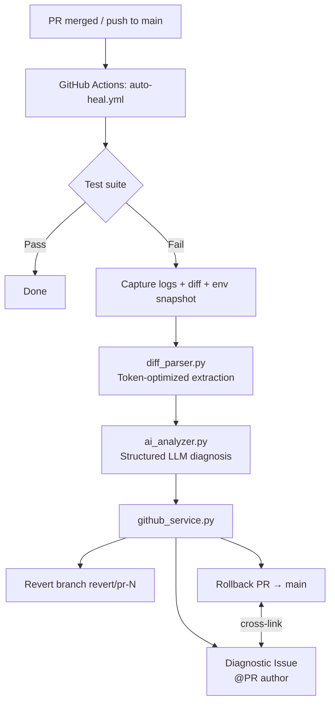

# Auto-Heal CI
Dev - Utkarsh Ajay Gawande

Enterprise-ready, open-source GitHub Action system that verifies PR merges on `main`, safely isolates breaking changes via automated **Rollback PRs**, and posts structured **AI-powered diagnostic reports**.

## Architecture



## Project layout

```
/
├── .github/workflows/auto-heal.yml
├── src/
│   ├── config.py
│   ├── diff_parser.py
│   ├── ai_analyzer.py
│   ├── github_service.py
│   └── main.py
├── tests/
├── requirements.txt
└── README.md
```

## Quick start

### 1. Repository secrets

| Secret | Required | Description |
|--------|----------|-------------|
| `GITHUB_TOKEN` | Yes (auto) | Provided by Actions; needs `contents`, `pull-requests`, `issues` write |
| `OPENAI_API_KEY` | If using OpenAI | API key for GPT models |
| `API_KEY` | If using OpenAI | Alias for `OPENAI_API_KEY` (either name works) |
| `ANTHROPIC_API_KEY` | If using Anthropic | API key for Claude models |

### 2. Repository variables (optional)

| Variable | Default | Description |
|----------|---------|-------------|
| `AUTO_HEAL_AI_PROVIDER` | `openai` | `openai` or `anthropic` |
| `AUTO_HEAL_AI_MODEL` | provider default | Override model name |

### 3. Local development

Use **one Python interpreter** for install, pytest, and the recovery CLI. Mixing
`pip` (system Python) with `pytest` (Conda) is a common cause of
`ModuleNotFoundError`.

```bash
# Install into the same interpreter you will run below
python -m pip install -r requirements.txt

# Unit tests (no API keys required)
python -m pytest tests/test_diff_parser.py tests/test_ai_analyzer.py -v

# Capture a failing CI log from the sample suite
python -m pytest tests/ -v --tb=short 2>&1 | tee test-output.log

# Diff artifact — use fixtures when not in a git repo yet
cp tests/fixtures/sample_merge.diff merge.diff
# Or, after git init + at least one commit:
# git diff HEAD~1..HEAD > merge.diff

# Dry-run AI analysis (requires a real API key)
export OPENAI_API_KEY="sk-..."   # from https://platform.openai.com/account/api-keys
export AUTO_HEAL_AI_PROVIDER=openai
python -m src.main --dry-run --log-file test-output.log --diff-file merge.diff
```

**Offline dry-run (no API keys required):**

```bash
cp tests/fixtures/sample_test_output.log test-output.log
cp tests/fixtures/sample_merge.diff merge.diff
python -m src.main --dry-run --mock-ai --log-file test-output.log --diff-file merge.diff
```

**Shortcut without running pytest first:**

```bash
cp tests/fixtures/sample_test_output.log test-output.log
cp tests/fixtures/sample_merge.diff merge.diff
python -m src.main --dry-run --mock-ai --log-file test-output.log --diff-file merge.diff
```

## Core modules (step 1)

### `requirements.txt`

Pinned dependencies: **Pydantic v2**, **OpenAI** / **Anthropic** SDKs, **PyGithub**, **pytest**.

### `src/diff_parser.py`

Token-optimized extraction pipeline:

- Parses pytest / Python traceback / npm failure signatures
- Extracts file references from stack traces
- Filters unified diff hunks to only implicated files
- Enforces `max_input_chars` budget before LLM calls

**Entry point:** `build_filtered_input(...)`

### `src/ai_analyzer.py`

Structured diagnostic engine:

- Pydantic schema: `DiagnosticReport` with `root_cause_summary`, `failing_files[]`, `blast_radius_assessment`, `confidence_score`, `suggested_fix_patch`
- Provider adapters: OpenAI JSON schema mode + Anthropic tool-use
- Retries with exponential backoff on timeout/rate-limit
- Markdown renderer: `report_to_markdown()`

**Entry point:** `DiagnosticEngine.from_config(ai_config).analyze(filtered_input)`

## Structured output schema

```json
{
  "root_cause_summary": "string",
  "failing_files": [
    {
      "file_path": "tests/test_sample_app.py",
      "line_numbers": [12],
      "explanation": "Assertion compares float to int."
    }
  ],
  "blast_radius_assessment": "Low — isolated test failure.",
  "confidence_score": 0.91,
  "suggested_fix_patch": "```diff\n- assert x == 4\n+ assert x == 5.0\n```"
}
```

## Workflow behavior

1. Triggers on merged PRs to `main` or direct pushes to `main`
2. Runs `pytest tests/`
3. On failure:
   - Uploads logs, diff, and env snapshot as artifacts
   - Runs `python -m src.main` to diagnose, open Rollback PR, and file Issue
4. Job exits non-zero so the merge is visibly red while rollback is pending

## Security notes

- Never commit API keys; use GitHub Secrets
- `GITHUB_TOKEN` is scoped to the repository
- Log/diff content is pre-filtered before leaving your CI runner for the LLM provider
- Rollback PRs require human review before merge (no auto-merge)

## License

MIT — see LICENSE file.
